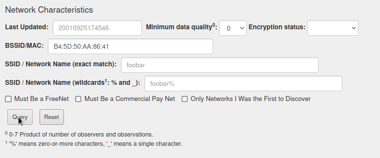
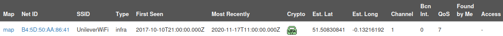
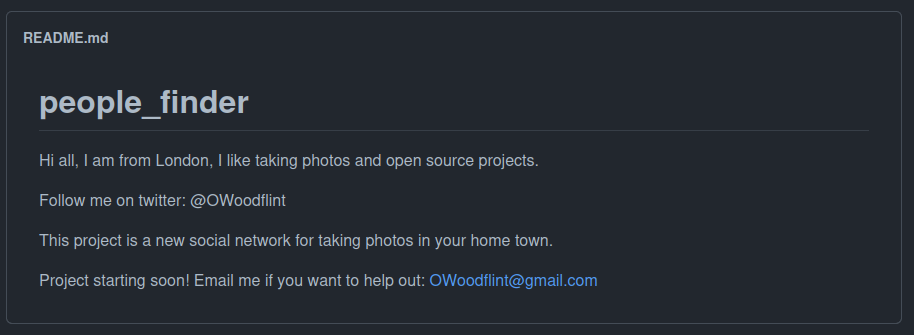
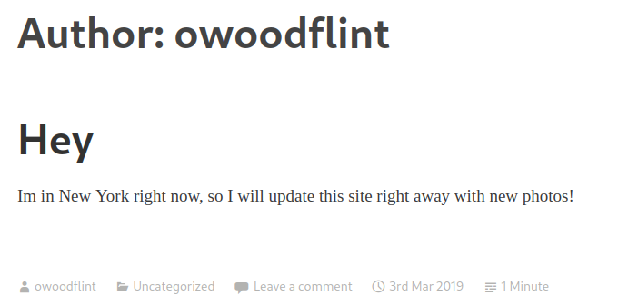
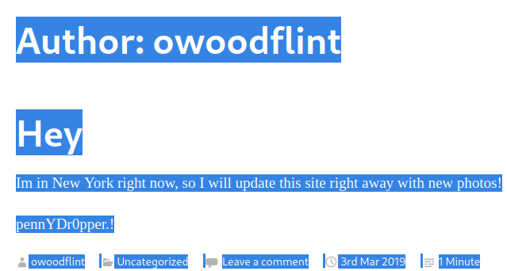

Hello friend. In this writeup we will uncover the power of OSINT (Open-Source Intelligence) by solving the  `OhSINT` challenge of `TryHackMe`.
We are only given an old Windows XP wallpaper. But there is more to the story.
Images contain metadata, the story behind the data. This can give us some juicy information.
To uncover the picture's metadata we will be using `ExifTool`.

```bash
$ exiftool WindowsXP.jpg
ExifTool Version Number         : 12.49
File Name                       : WindowsXP.jpg
Directory                       : .
File Size                       : 234 kB
File Modification Date/Time     : 2023:01:03 14:33:13+02:00
File Access Date/Time           : 2023:01:28 17:05:12+02:00
File Inode Change Date/Time     : 2023:01:03 14:33:13+02:00
File Permissions                : -rwxr-xr-x
File Type                       : JPEG
File Type Extension             : jpg
MIME Type                       : image/jpeg
XMP Toolkit                     : Image::ExifTool 11.27
GPS Latitude                    : 54 deg 17' 41.27" N
GPS Longitude                   : 2 deg 15' 1.33" W
Copyright                       : OWoodflint
Image Width                     : 1920
Image Height                    : 1080
Encoding Process                : Baseline DCT, Huffman coding
Bits Per Sample                 : 8
Color Components                : 3
Y Cb Cr Sub Sampling            : YCbCr4:2:0 (2 2)
Image Size                      : 1920x1080
Megapixels                      : 2.1
GPS Latitude Ref                : North
GPS Longitude Ref               : West
GPS Position                    : 54 deg 17' 41.27" N, 2 deg 15' 1.33" W
```

We can see there is a copyright from `OWoodflint`. 
By googling the username we find his Twitter, Github and also his blog.

> **Social Media** <br>
> Twitter: https://twitter.com/OWoodflint <br>
> Blog: https://oliverwoodflint.wordpress.com/author/owoodflint/ <br>
> Github: https://github.com/OWoodfl1nt/people_finder <br>

Taking a look at his tweet we can see that he is kind enough to share his BSSID (Router ID). We can now answer the first question since we clearly see his avatar is a cat.

> From my house I can get free wifi ;D Bssid: B4:5D:50:AA:86:41 - Go nuts!

There is no better way to thank him than to track him down ;)
To do that we will be using [WiGLE](https://wigle.net). After you register your account head over to `View` -> `Advanced Search`.





We obtain the `SSID`. The next question asks us for the personal email of the user. Twitter does not give out the email in the profile. But since he has a Github account maybe he included contact details to one of his repositories.



Great! Now we need to know where OWoodflint's gone on holiday. People love to brag about it in their blogs and this guy has one. 



Now we need his password. Perhaps he stored it in the blog's source. Do not dare to say this is stupid. The guy posted his `BSSID` on twitter :P. Let's just press `Ctrl + A` to highlight everything inside of the pages body.



And here it is! Congrats you can now call yourself an "osinter" :D

# Goodbye
I hope you enjoyed this writeup. Please star the repository if you did and feel free to open an issue if you didn't! I'd love to discuss about it with you :D

- skelet0n
